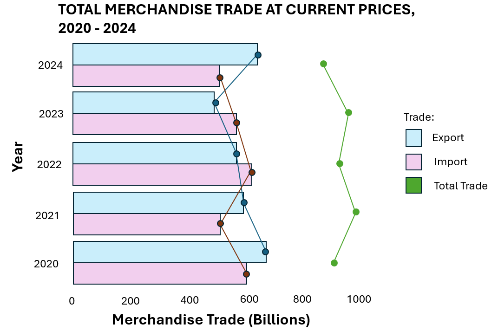
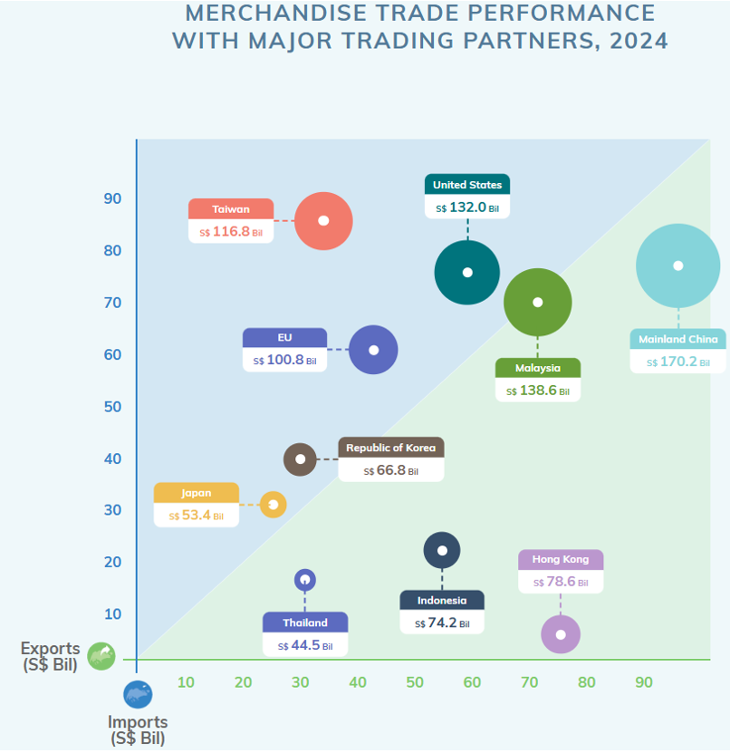
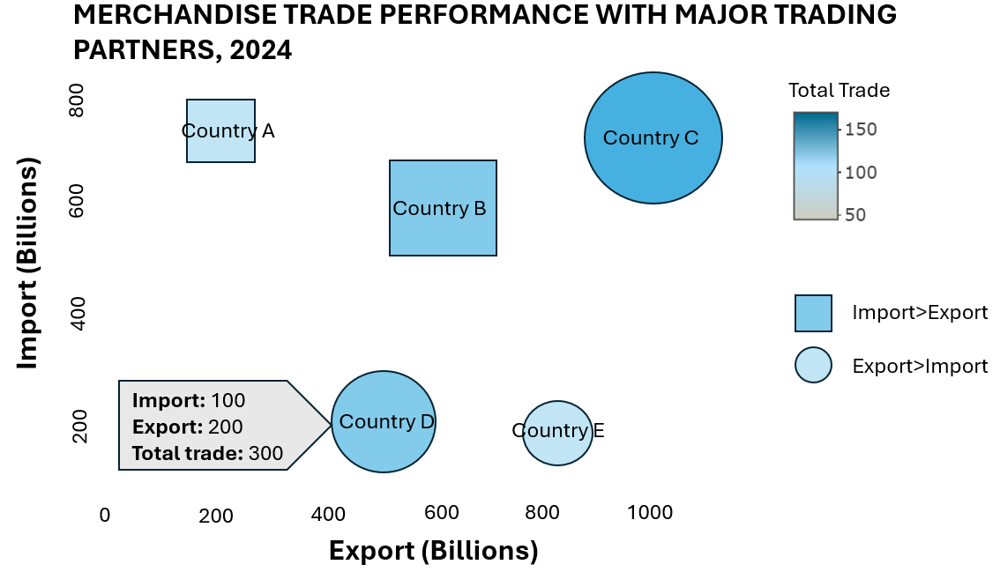
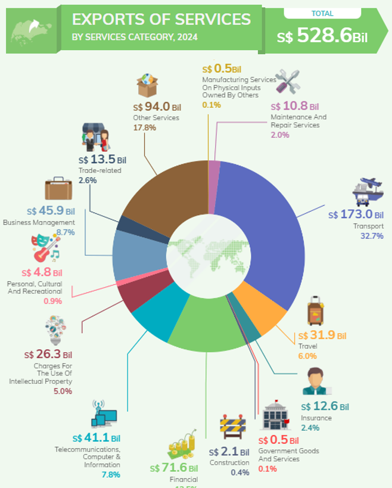
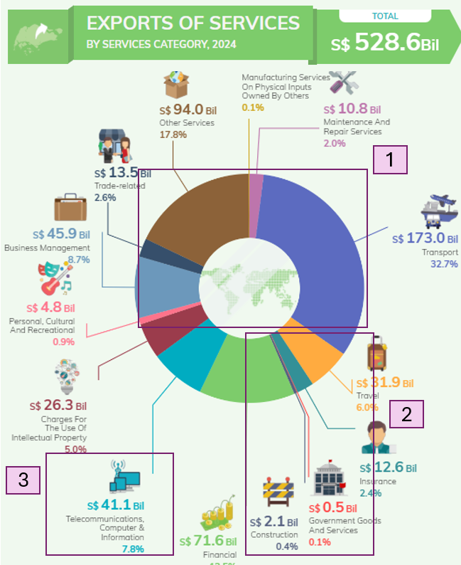
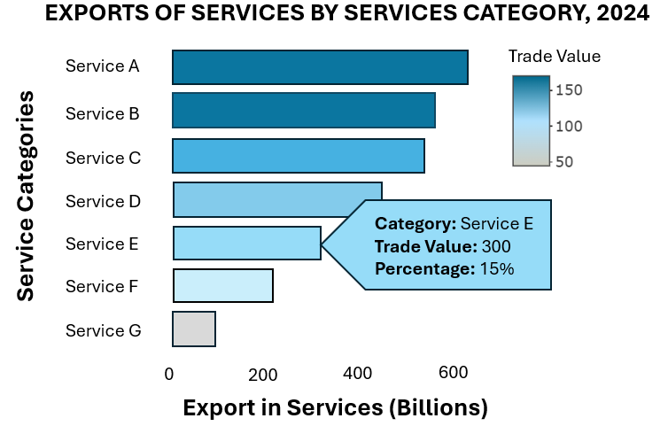

### **1 Overview**

Singapore is a major global trading hub. In this exercise, we will be examining the changing trends and patterns of Singapore’s international trade since 2015, using the trade data obtained from Department of Statistics Singapore.

The main objective of this exercise will be to:

-   critique on the visualisations prepared by Department of Statistics Singapore and provide sketches of makeover
-   create makeover of the visualisations using R packages
-   analyse the data with using time-series analysis or time-series forecasting methods

### **2 Getting Started**

::: panel-tabset
## Loading Packages

The following packages will be used in this exercise:

-   tidyverse for manipulating the dataset
-   plotly for making interactive plots
-   tsibble, feasts, fable and seasonal for time series forecasting

```{r}
pacman::p_load(tidyverse, plotly, tsibble, feasts, fable, seasonal)
```

## Importing Dataset
Merchandise Trade by Region/Market and Trade In Services By Services Category data was downloaded from [Department of Statistics Singapore](https://www.singstat.gov.sg/)
```{r}
import_data <- read_csv("data/Import.csv")
export_data <- read_csv("data/Export.csv")
re_export_data <- read_csv("data/Reexport.csv")
service_data <-read_csv("data/Services.csv")
```
:::

### **3 Data Visualisation Makeover**

#### **3.1 TOTAL MERCHANDISE TRADE AT CURRENT PRICES, 2020 - 2024**

::: panel-tabset
## Original


-   Distinct colors are used for each year, making it immediately clear to readers which bars correspond to specific years, enhancing the readability of the chart.
-   Plotting of export and import data on the same bar chart facilitates an easy and intuitive comparison of the two categories, both within individual years and across different years.
-   Inclusion of value labels on each bar makes it easier for readers to interpret the data at a glance.

## Areas for improvement


1.  While varying shades are used to differentiate between the export and import bars, this approach may not be entirely intuitive, particularly when the color contrast is minimal, for example the yellow shade used for the year 2021. Furthermore, repeated use of export and import labels for every year's data can be redundant. Assigning distinct colors for export and import and including a unified legend may be better.
2.  It is difficult for readers to quickly compare the total merchandise trade values as there is no clear visual representation of the total trade across years.
3.  Similarly, the increase in merchandise trade of 6.6% in 2024 is not immediately discernible from the graph. A line graph overlay or an additional bar for total trade could make these trends more apparent and easier to compare.
4.  The value labels on the bar chart may be a little difficult to see, in the case of yellow bar for 2021, due to lack of contrast.
5.  Adding axis tick marks would help readers gauge the values more easily.

## Makeover Sketch


:::

To revamp the plot, the dataset first needs to be re-organised to extract the relavnt data. `pivot_longer()` is used to re-arrange the import, export and re-export data into the long format.Subsequently, a new column containing just the year of the trade data is created, using `substr` and `paste0`. The import, epxport, re-export data are then merged into a single table, using `merge`. New columns containing the total exports and total trade amounts are subsequently created.

```{r}
#Wrangling data
import_pivot<-import_data %>% 
  pivot_longer(
    cols = starts_with("2"), 
    names_to = "Date", 
    values_to = "Import"
  )

import_pivot$Year <- as.numeric(paste0(substr(import_pivot$Date,1,4)))

export_pivot<-export_data %>% 
  pivot_longer(
    cols = starts_with("2"), 
    names_to = "Date", 
    values_to = "Export"
  )

export_pivot$Year <- as.numeric(paste0(substr(export_pivot$Date,1,4)))

re_export_pivot<-re_export_data %>% 
  pivot_longer(
    cols = starts_with("2"), 
    names_to = "Date", 
    values_to = "Re_export"
  )

re_export_pivot$Year <- as.numeric(paste0(substr(re_export_pivot$Date,1,4)))

#Merge the tables
df<- merge(import_pivot, export_pivot, by = c("Data Series","Date", "Year"), all = TRUE) 
df<- merge(df, re_export_pivot, by = c("Data Series","Date", "Year"), all = TRUE) 

#Combining exports
df$Total_export<-df$Export+df$Re_export
df$Total_trade<-df$Import+df$Total_export
```

Next, only the import, total export and total trade data for the total merchandise trade from 2020 to 2024 are extracted, using `filter`. Subsequently, `pivot_longer` is used to change the data into the long format. `group_by` and `summarise` are used to sum up the trade values by the year and the trade type. The trade values are also converted into billions by dividing by 1000.

```{r}
#Extracting relevant data
df_1 <- df[,c("Data Series", "Year", "Import", "Total_export", "Total_trade")] %>%
 filter(Year>= 2020 & Year <= 2024 & `Data Series`=="Total All Markets")%>%
  pivot_longer(
    cols =c("Import", "Total_export", "Total_trade"), 
    names_to = "Trade", 
    values_to = "Value"
  )
df_1<-  df_1[,c("Year", "Trade", "Value")] %>% 
  group_by( Year, Trade) %>% 
  summarise(across(everything(), sum),
            .groups = 'drop')  
df_1$Value<-df_1$Value/1000
df_1$Trade<-factor(df_1$Trade, levels = c("Import", "Total_export", "Total_trade"), ordered = TRUE)

```

To revamp the chart, we will create a bar chart for the import and total exports. We will color the bars according to the trade category. In addition, we overlay the bar chart with line graphs to display the change in trade value for import, export and total trade, across the years.

```{r}
#| code-fold: true
#| code-summary: "Show the code"
#Plotting bar chart
ggplot(data=df_1[df_1$Trade!="Total_trade",], aes(x=Year,y=Value, fill=Trade))+
  geom_col(position='dodge')+
  scale_fill_manual(values=c("lightsteelblue", "thistle", "grey"),
                     labels = c("Imports", "Exports", "Total Trade"))+
   coord_flip()+
  geom_label(aes(Year, label =sprintf("%.1f", Value),y = Value * 0.02),
            position = position_dodge2(width = 0.9),
            fill="white",
            hjust=0,
            size=3
            )+
  
  #Line for total trade
 geom_line(data = df_1[df_1$Trade == "Total_trade",], 
            aes(x = Year, y = Value, group = 1),  
            color = "#698B69", size = 1) +
  geom_point(data = df_1[df_1$Trade == "Total_trade",],  
             aes(x = Year, y = Value), 
             color = "#008B00", size = 3)+
  geom_label(data = df_1[df_1$Trade == "Total_trade",], 
             aes(x = Year+0.3, y = Value, label = sprintf("%.1f", Value)),
             fill = "white", size = 3, nudge_y = 0.1) +
  
   # Line for Import
  geom_path(data = df_1[df_1$Trade == "Import",], 
            aes(x = Year-0.22, y = Value, group = Trade),  
            color = "#607B8B", size = 1, linetype = "dashed") +
  geom_point(data = df_1[df_1$Trade == "Import",],  
             aes(x = Year-0.22, y = Value), 
             color = "#104E8B", size = 2) +

  # Line for Total Export
  geom_path(data = df_1[df_1$Trade == "Total_export",], 
            aes(x = Year+0.22, y = Value, group = Trade),  
            color = "#8B2500", size = 1, linetype = "dashed") +
  geom_point(data = df_1[df_1$Trade == "Total_export",],  
             aes(x = Year+0.22, y = Value), 
             color = "#8B0000", size = 2)+
  scale_y_continuous(breaks = seq(0, max(df_1$Value), by = 200),
                     limits = c(0, max(df_1$Value) + 100))+
  labs(y="Merchandise Trade (Billions)", title="TOTAL MERCHANDISE TRADE
AT CURRENT PRICES, 2020 - 2024")
```

Changes made:

-   Instead of coloring by year, we colour by the type of trade and place the year labels at the y axis. This reduces unnecessary repetition of labels.
-   Colors used are also vastly different and prevents any confusion. - Axis tick labels added for merchandise trade to enable readers to easily read the graph.
-   Line graph showing the total trade is added to enable easier visualisation of total trade value changes.

#### **3.2 MERCHANDISE TRADE PERFORMANCE WITH MAJOR TRADING PARTNERS, 2024**

::: panel-tabset
## Original



-   There is a partition separating the countries who have greater imports from Singapore than exports, from countries who have greater export from Singapore than imports. This allows easy identification of the 2 groups.

-   The data points are varied in size, with the size representing Singapore’s total merchandise trade value with the trading partner, making it easy to differentiate countries with small merchandise trade value from countries with large merchandise trade value at one glance.

-   The font and colors are easy to read and appealing.

## Areas for improvement


1.  The axis labels are at the origin of the graph, which may be less intuitive for readers

2.  The current value labels only display the total trade amount, which requires readers to estimate the exact contribution of exports and imports based on the position of the data points. Including separate value labels for export and import amounts alongside the total trade value will allow readers to easily compare the export and import values for each trading partner without having to rely on visual estimation.

3.  While the varying sizes of data points help to visualize trade volume, the sizes of the data points for certain countries, such as Taiwan, the United States, and Malaysia, appear very similar. This makes it challenging for viewers to distinguish which country has a higher total trade value based solely on the size of the data point. Employing additional visual cues, such as gradient coloring may help to make the difference more apparent.

## Makeover Sketch


:::

To revamp the graph, we first consolidate the list of major trading partners in 2024 and rename all countries in EU as EU, 'China' as "Mainland China", "Korea, Rep Of" as "Republic of Korea" using `ifelse` statements.

The trade data for the major trading partners in 2024 are then aggregated using `filter`, group_by`and`summarise\`. Trade values are also converted into billions.

```{r}
EU<-c("Austria", "Belgium", "Bulgaria", "Croatia", "Cyprus", "Czech Rep", "Denmark", "Estonia", "Finland", "France", "Germany", "Greece", "Hungary", "Ireland", "Italy", "Latvia", "Lithuania", "Luxembourg", "Malta", "Netherlands", "Poland", "Portugal", "Romania", "Slovakia", "Slovenia", "Spain", "Sweden")

TP_names <- c("United States", "Mainland China", "Hong Kong", "Indonesia", "Japan", "Republic of Korea", "Malaysia", "Taiwan", "Thailand", "EU")

df_2 <- df[,c("Data Series", "Year", "Import", "Total_export", "Total_trade")] 

df_2$`Data Series`<-ifelse(df_2$`Data Series`%in% EU, "EU", ifelse(df_2$`Data Series`=="China", "Mainland China", ifelse(df_2$`Data Series`=="Korea, Rep Of", "Republic of Korea", df_2$`Data Series`)))

df_2<- df_2 %>%
 filter(Year== 2024 & `Data Series`%in% TP_names)
  
df_2<-  df_2[,c("Data Series", "Import", "Total_export", "Total_trade")] %>% 
  group_by( `Data Series`) %>% 
  summarise(across(everything(), sum),
            .groups = 'drop')  
df_2$Import<-df_2$Import/1000
df_2$Total_export<-df_2$Total_export/1000
df_2$Total_trade<-df_2$Total_trade/1000
df_2$Net<-ifelse(df_2$Import>df_2$Total_export, "Import>Export","Export>Import")
```

Next, a bubble plot is created using `plotly`. The changes made are:

-   Tooltip is used to display the import, export and total trade values.
-   Both size and the color of the marker is set to vary by the total trade amount.
-   Axis labels are set to the middle of the axis, avoids confusion.
-   The shape of the marker is used to differentiate between trading partners with more import than export and trading partners with more export than import. This enables easier identification of the 2 different groups of trading partners compared to the position of the marker.

```{r}
#| code-fold: true
#| code-summary: "Show the code"
p<-plot_ly(df_2, x = ~Total_export, y = ~Import, type = 'scatter', mode = 'markers', color = ~Total_trade, colors = "Reds", size = ~Total_trade, hoverinfo = "text",symbol = ~Net,       
             symbols = c("circle", "square"),
        marker = list( sizemode = 'diameter',
                      line = list(width = 1, color = 'black', opacity=0.7)), text = ~paste('<b>Import:</b>', sprintf("%.1f", Import), '<br><b>Export:</b>', sprintf("%.1f", Total_export), '<br><b>Total Trade:</b>', sprintf("%.1f", Total_trade)))
p <- p %>% layout(title = list(text = '<b>Merchandise Trade Performance with Major Trading Partners, 2024</b>', 
                      x = 0.5),  
         xaxis = list(title = '<b>Export (in billions)</b>', 
                      showgrid = FALSE,
                      zeroline = FALSE,
                      titlefont = list(size = 14),
                      dtick = 20),
         yaxis = list(title = '<b>Import (in billions)</b>', 
                      showgrid = FALSE,
                      zeroline = FALSE,
                      titlefont = list(size = 14)),
         margin = list(l = 80, r = 50, t = 60, b = 60))  
p<- p %>% add_annotations(x = df_2$Total_export,
                  y = df_2$Import,
                  text = df_2$`Data Series`,
                  xref = "x",
                  yref = "y",
                 showarrow = F
                 )
p<- p %>%colorbar(title = "Total Trade (Billions)")
p
```

#### **3.3 EXPORTS OF SERVICES BY SERVICES CATEGORY, 2024**

::: panel-tabset
## Original



-   Each category of service is clearly labelled, with the service name, the value of the service and the proportion of the service value over the total. The inclusion of both absolute values and percentages helps the audience to have a better understanding of the scale and proportions.

-   In addition, each category has a unique icon to enable readers to quickly associate the service categories with their industries. -Labels are placed outside of the chart, which enhances readability of the chart.

## Areas for improvement



1.  Pie charts are not the best for comparing multiple categories as it is difficult for us to visually judge the relative area for each category.A bar chart may be a better visualisation. In addition, the categories are not arranged in descending order to make it easier to interpret the largest to smallest contributions. Furthermore, there are more than 10 categories displayed on the chart, each with its own color. Too many colors may make it harder for the viewer to quickly interpret the chart and identify the key insight from the chart.

2.  The chart is very cluttered. The label lines for the consruction and the government goods and services categories are overlapping, which may make it confusing and difficult to read.

3.  While the addition of icons add a nice visual touch, they could be reduced in size to minimize distraction from the main message of the chart and to reduce the cluttering of the chart.

## Makeover Sketch


:::

To revamp the chart, the 2024 export in services data was extracted. Only data of the service categories plotted in the original chart was retained.

```{r}
#Wrangling data
df_3<-service_data %>% slice(3:26) 
df_3<-df_3[,c("Data Series", "2024")]
df_3$`2024`<-df_3$`2024` / 1000

#removing unnecessary rows
df_3 <- df_3[-c(4,5, 14), ]

#Redefine other services category
others<- c("Accounting", "Advertising And Market Research", "Architectural", "Engineering And Technical", "Legal", "Research And Development", "Operating Leasing", "Others")
df_3$`Data Series`<-ifelse(df_3$`Data Series` %in% others, "Other Services", df_3$`Data Series`)
df_3<-df_3%>% 
  group_by( `Data Series`) %>% 
  summarise(across(everything(), sum),
            .groups = 'drop')  
```

Next, a bar chart is created using `ggplot` and made interactive using `ggplotly`. The changes made are as follows:

-   Bar chart is created instead of a pie chart to enable better comparison of the categories.
-   The bars are colored by the trade value.
-   Tooltip is used to provide the description of the trade value and the percentages, reducing clutter on the chart.
-   The bar chart is ordered in descending order, enabling readers to identify the services with top trade value easily.

```{r}
#| code-fold: true
#| code-summary: "Show the code"
df_3$Percentage <- df_3$`2024` / sum(df_3$`2024`) * 100
p<-ggplot(df_3, aes(x=reorder(`Data Series`, `2024`), y=`2024`, fill=`2024`, text = paste0("Category: ", `Data Series`, 
                                                                                     "<br>Trade Value: S$", round(`2024`,1), "B",
                                                                                     "<br>Percentage: ", round(Percentage, 1), "%")))+
  geom_col()+
  coord_flip()+
  scale_fill_gradient(low="#B0E2FF", high="#104E8B", name="Trade Value (billions)")+
  labs(y="Exports of Services (billions)", x="Service Categories",
       title="EXPORTS OF SERVICES BY SERVICES CATEGORY, 2024")+
  theme(
    legend.title = element_text(size = 9),  
    axis.text = element_text(size = 7)
  )

p<-ggplotly(p, tooltip = "text") %>% 
  layout(yaxis=list(title=list( standoff = 5)))
p

```

### **4 Time Series Analysis** 

We will analyse the trends and patterns of Singapore’s international trade since 2015, by examining the total market import values.

The relevant data are first extracted using `filter`. Subsequently, the date values are converted from character format into date format using `parse_date_time` and a new column containing the date in months format is created. A tsibble object is created and the data is separated into 2 categories, 'Hold-out' and 'Training'. All the data from 2015 to 2023 are used as training data.

```{r}
df_4<-df %>% filter(Year>= 2015 & `Data Series` =="Total All Markets")
df_4<-df_4[,c("Data Series", "Date", "Year", "Import")]
df_4$Date <- parse_date_time(df_4$Date, orders = "Y m")
df_4 <- df_4 %>%
  mutate(Month = yearmonth(`Date`)) %>%
  as_tsibble(index = Month, key = `Data Series`)
df_4$Type<-ifelse(df_4$Year>=2024, "Hold-out", "Training")

```

::: panel-tabset

## EDA
```{r}
#| fig-height: 5
train_data<-df_4%>% filter(Type=="Training")
train_data %>%
  model(stl = STL(Import)) %>%
  components() %>%
  autoplot()

```
-   The Total All Markets showed a gradual increase in imports from 2015 to early 2024, with a s-shaped pattern. There was a dip in imports in 2020, possibly due to the COVID-19 pandemic. From 2021 to early 2023, there was a sharp increase in imports, possibly due to recovery from the pandemic. However, imports started to decline from mid 2023 to early 2024.

-   The Total All Markets exhibits a clear yearly cyclical import pattern. The import values usually decline near the end of the year and is at its lowest at the start of the year, before recovering and rising to its peak near the first quarter of the year. This pattern may be attributed to the major holiday seasons (end of year and lunar new year).

## glance
```{r}
model_fit <- train_data %>%
  model(
    ets = ETS(Import),
    arima = ARIMA(Import)
  )  
model_fit%>%
  glance()

```

The log-likelihood is higer for the ARIMA model and the AIC, AICc and BIC values for ARIMA model is lower, compared to the values for the ETS model, suggesting that the ARIMA model may be a better fit than ETS model.


## accuracy
```{r}
model_fit %>%
  accuracy() %>%
  arrange(`Data Series`)
```
The ETS model appears to have better accuracy compared to ARIMA model, as it has lower RMSE, MAE, MAPE, MASE, and RMSSE values.

## Forecast

```{r}

fc <- model_fit %>%
  forecast(h = "12 months")

fc %>%
  autoplot(df_4)
```

-   Both ARIMA (red) and ETS (blue) models showed slightly different trends from the actual data points. However, the actual data points still fall within the 80% confidence intervals. This suggests that the models could be further improved, or that there may be unexpected shifts that occurred that could not be accounted for in the models.

-   ARIMA shows higher variance, implying that the model accounts for possible large fluctuations in the future. In contrast, ETS has lower variance, meaning it assumes more stable trends.

:::


