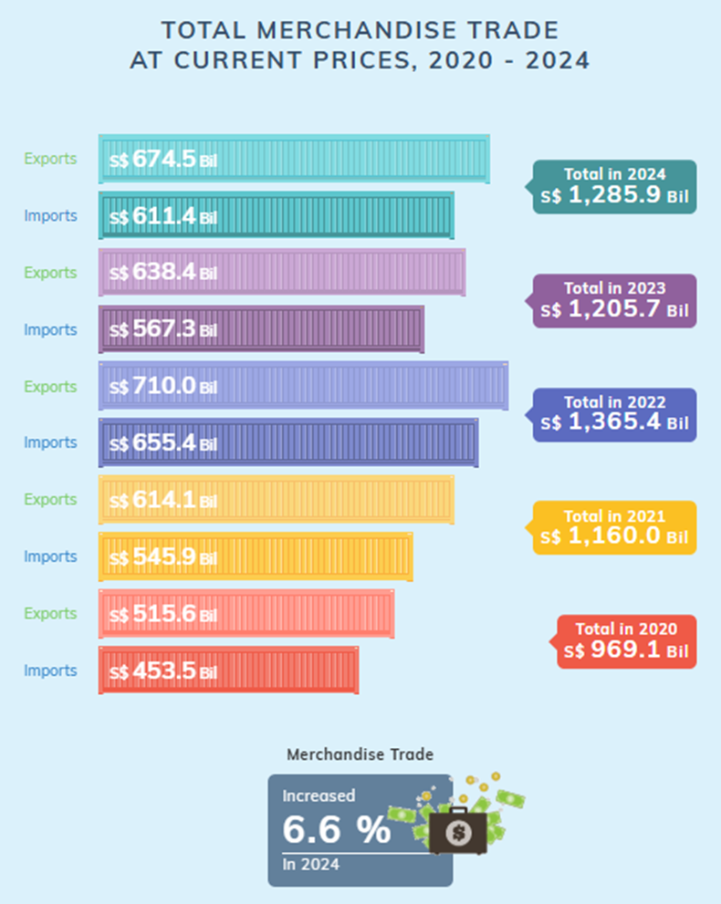
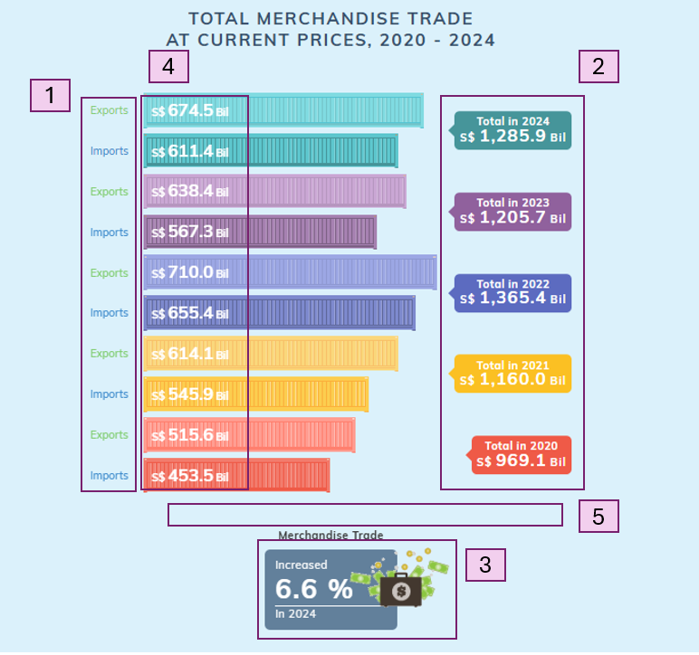
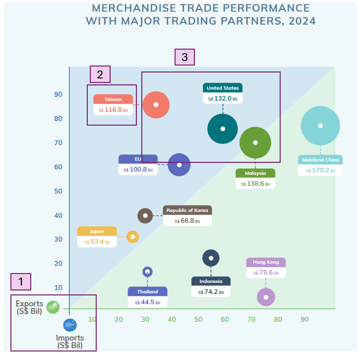
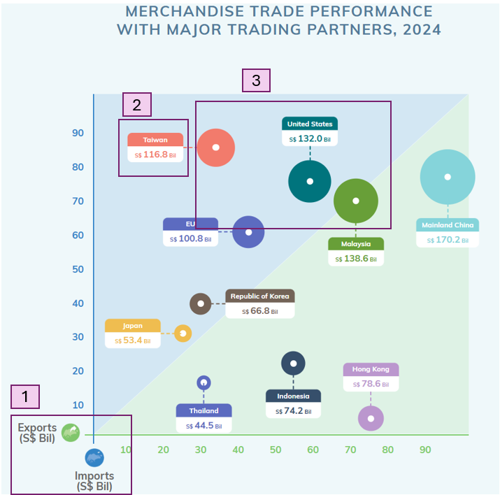

### **1 Overview**

Singapore is a major global trading hub. In this exercise, we will be examining the changing trends and patterns of Singapore’s international trade since 2015.

The main objective of this exercise will be to:

-   critique on the visualisations prepared by Department of Statistics Singapore and provide sketches of makeover
-   create makeover of the visualisations using R packages
-   analyse the data with using time-series analysis or time-series forecasting methods

### **2 Getting Started**

::: panel-tabset
## Loading Packages

```{r}


```

## Importing Dataset

```{r}

```
:::

### **3 Data Visualisation Makeover**

#### **3.1 TOTAL MERCHANDISE TRADE AT CURRENT PRICES, 2020 - 2024**

::: panel-tabset
## Original



-   Distinct colors are used for each year, making it immediately clear to readers which bars correspond to specific years, enhancing the readability of the chart.
-   Plotting of export and import data on the same bar chart facilitates an easy and intuitive comparison of the two categories, both within individual years and across different years.
-   Inclusion of value labels on each bar makes it easier for readers to interpret the data at a glance.

## Areas for improvement



1.  While varying shades are used to differentiate between the export and import bars, this approach may not be entirely intuitive, particularly when the color contrast is minimal, for example the yellow shade used for the year 2021. Furthermore, repeated use of export and import labels for every year's data can be redundant. Assigning distinct colors for export and import and including a unified legend may be better.
2.  It is difficult for readers to quickly compare the total merchandise trade values as there is no clear visual representation of the total trade across years.
3.  Similarly, the increase in merchandise trade of 6.6% in 2024 is not immediately discernible from the graph. A line graph overlay or an additional bar for total trade could make these trends more apparent and easier to compare.
4.  The value labels on the bar chart may be a little difficult to see, in the case of yellow bar for 2021, due to lack of contrast.
5.  Adding axis tick marks would help readers gauge the values more easily.

## Makeover Sketch
:::

MAKEOVER DESCRIPTION

#### **3.2 MERCHANDISE TRADE PERFORMANCE WITH MAJOR TRADING PARTNERS, 2024**

::: panel-tabset
## Original



-   There is a partition separating the countries who have greater imports from Singapore than exports, from countries who have greater export from Singapore than imports. This allows easy identification of the 2 groups.

-   The data points are varied in size, with the size representing Singapore’s total merchandise trade value with the trading partner, making it easy to differentiate countries with small merchandise trade value from countries with large merchandise trade value at one glance.

-   The font and colors are easy to read and appealing.

## Areas for improvement



1.  The axis labels are at the origin of the graph, which may be less intuitive for readers

2.  The current value labels only display the total trade amount, which requires readers to estimate the exact contribution of exports and imports based on the position of the data points. Including separate value labels for export and import amounts alongside the total trade value will allow readers to easily compare the export and import values for each trading partner without having to rely on visual estimation.

3.  While the varying sizes of data points help to visualize trade volume, the sizes of the data points for certain countries, such as Taiwan, the United States, and Malaysia, appear very similar. This makes it challenging for viewers to distinguish which country has a higher total trade value based solely on the size of the data point. Employing additional visual cues, such as gradient coloring may help to make the difference more apparent.

## Makeover Sketch


:::

MAKEOVER DESCRIPTION

#### **3.3 **

::: panel-tabset
## Original

## Areas for improvement


## Makeover Sketch

:::

### **4 **
