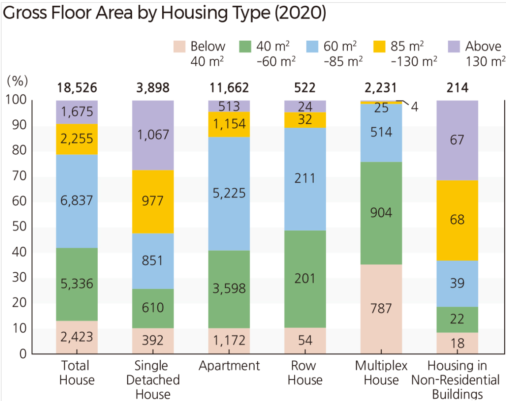

### **1 Background**
In this take-home exercise, I will be prototyping a shiny module for my group project, which aims to investigate how various factors, with a greater focus on the environmental amenities and the built environment factors, influences property prices in Korea. 

THe objectives of this exercise includes:

-   To evaluate and determine the necessary R packages needed for the Shiny application are supported in R CRAN,
-   To prepare and test the specific R codes can be run and return the correct output as expected,
-   To determine the parameters and outputs that should be exposed on the Shiny applications, and
-   To select the appropriate Shiny UI components for exposing the parameters determine above.

Specifically, I will be working on a shiny module to perform Exploratory Data ANalysis (EDA) and Confirmatory Data Analysis (CDA).

### **2 Getting Started**

::: panel-tabset
## Loading Libraries

We will load the following packages: 

-   tidyverse to wrangle data 
-   SmartEDA to explore data
-   ggdist for visualising distributions and uncertainty
-   parallelPlot for plotting parallel coordinates plot with histogram
-   ggstatsplot for correlation heat map
-   ggside for adding histograms to scatterplot
-   plotly for interactive plots
-   ggpubr to add statistical test results
```{r}
pacman::p_load(tidyverse,  SmartEDA, ggdist, parallelPlot,  ggstatsplot, ggside, plotly, ggpubr)
```

## Importing Dataset

In this exercise, we will be using the exam data

```{r}
Property_data <- read_csv("data/Property_Price_and_Green_Index.csv")
```

## Glimpse data

Majority of the variables in the dataset are continuous variables

```{r}
glimpse(Property_data)
```

## Missing data

We check for any columns with missing data using `ExpData()` from SmartEDA package. There are no missing data in this dataset.

```{r}
Property_data %>%
  ExpData(type=2)
```

## Duplicated Records

We check for presence of duplicated records using `duplicated()`. The results show that there are no duplicated records.

```{r}
Property_data[duplicated(Property_data),]
```
:::

### **3 Data Wrangling**

#### **3.1 Create Seasons Variable**

The season of transaction is currently encoded as dummy variables in 3 separate columns. Thus, We create a new seasons variable to consolidate the data into a single column, using `ifelse` statements.

```{r}
Property_data$Season <- ifelse(Property_data$Spring==1, "Spring", ifelse(Property_data$Fall==1, "Fall", ifelse(Property_data$Winter==1, "Winter", "Summer")))
```

#### **3.2 Bin House Size**

As we have many continuous variables in the dataset, it will be useful to bin some of the continuous variables into categorical variables for further analyses in our project. The distribution of the size of the houses in the dataset is shown in the histogram below. Majority of the houses have size of less than 100m^2^, with a relatively small number having size greater than 130m^2^.

```{r}
ggplot(Property_data, aes(Size)) +
  geom_histogram(boundary = 100,
                 color="black", 
                 fill="#7F948F") +
  labs(title = "Frequency of Size", x="Size (m\u00B2)")+
  scale_x_continuous(n.breaks = 20)
```

In a figure from the [National Atlas of Korea](http://nationalatlas.ngii.go.kr/pages/page_2687.php) on gross floor area by housing type, the floor area has been categorised into 5 categories and hence we will bin the house sizes similarly as well: (1) Below 40m^2^ (2) 40-\<60m^2^(3) 60-\<85m^2^ (4) 85-\<130m^2^ (5) 130m^2^ and above



```{r}
Property_data$Size_binned <- ifelse(Property_data$Size<40, "<40", ifelse(Property_data$Size<60, "40-<60", ifelse(Property_data$Size<85, "60-<85", ifelse(Property_data$Size<130, "85-<130", "\u2265 130"))))
```

#### **3.3 Bin House Floor**

The distribution of the house floors are shown in the histogram below. Majority of the houses are below 40 floors.

```{r}
ggplot(Property_data, aes(Floor)) +
  geom_histogram(boundary = 100,
                 color="black", 
                 fill="#7F948F") +
  labs(title = "Frequency of Floor")+
  scale_x_continuous(n.breaks = 20)
```

Based on the graph, we could categorise the floor levels into: (1) Low: \<6 (2) Middle: 6-15 (3) Middle-high: 16-25 (4) High: 26-40 (5) Top: \>40

```{r}
Property_data$Floor_binned <-ifelse(Property_data$Floor<6,"Low", ifelse(Property_data$Floor<16,"Middle",ifelse(Property_data$Floor<26,"Middle-high", ifelse(Property_data$Floor<41,"High", "Top"))))
```

#### **3.3 Bin House Construction Year**

The year of construction of the houses transacted in the dataset ranges from 1969 to 2019. We will bin the years: (1) 1960s to 1970s: 1969 - 1979 (2) 1980s to 1990s: 1980-1999 (3) 2000s: 2000-2009 (4) 2010s: 2010-2019

```{r}
Property_data$Year_binned <-ifelse(Property_data$Year<1980, "1969-1979",ifelse(Property_data$Year<2000, "1980-1999", ifelse(Property_data$Year<2010, "2000-2009", "2010-2019")))
```

### **4 EDA**
#### **Distributions of Environmental Amenities and Local Built Environments**
Firstly, we will generate boxplots and display smoothed histogram to visualise the distributions of the continuous variables in the dataset. In particular, we will look at the distributions of the environmental amenities and local built environments as part of the focus of our project. The environmental factors included in our dataset includes: 

-   Dist. Green: Log-transformed network distance to the nearest park, hill, or mountain in meters
-   Dist. Water: Log-transformed network distance to the nearest river, stream, pond, or seashore in meters
-   Green Index: Degree of street greenness exposed to pedestrians
-   Dist. Subway: Log-transformed network distance to the nearest subway station in meters
-   Bus Stop: Number of bus stops within a 400-meter radius of a property
-   High School: Number of high schools within a 5-km radius of a property


```{r}
p1<-ggplot(Property_data, 
       aes(x = `Bus Stop`, 
          )) +
  stat_halfeye(adjust = 0.5,
               justification = -0.1,
               .width = 0,
               point_colour = NA,
                position = position_dodge(0.1)) +
  geom_boxplot(width = .2,
               position = position_dodge(0.3),
               outlier.shape = NA)+
  labs(y="Density")

p2<-ggplot(Property_data, 
       aes(x = `Dist. Green`, 
          )) +
  stat_halfeye(adjust = 0.5,
               justification = -0.1,
               .width = 0,
               point_colour = NA,
                position = position_dodge(0.1)) +
  geom_boxplot(width = .2,
               position = position_dodge(0.3),
               outlier.shape = NA)+
  labs(y="Density")

p3<-ggplot(Property_data, 
       aes(x = `Dist. Water`, 
          )) +
  stat_halfeye(adjust = 0.5,
               justification = -0.1,
               .width = 0,
               point_colour = NA,
                position = position_dodge(0.1)) +
  geom_boxplot(width = .2,
               position = position_dodge(0.3),
               outlier.shape = NA)+
  labs(y="Density")

p4<-ggplot(Property_data, 
       aes(x = `Green Index`, 
          )) +
  stat_halfeye(adjust = 0.5,
               justification = -0.1,
               .width = 0,
               point_colour = NA,
                position = position_dodge(0.1)) +
  geom_boxplot(width = .2,
               position = position_dodge(0.3),
               outlier.shape = NA)+
  labs(y="Density")
p5<-ggplot(Property_data, 
       aes(x = `Dist. Subway`, 
          )) +
  stat_halfeye(adjust = 0.5,
               justification = -0.1,
               .width = 0,
               point_colour = NA,
                position = position_dodge(0.1)) +
  geom_boxplot(width = .2,
               position = position_dodge(0.3),
               outlier.shape = NA)+
  labs(y="Density")

p6<-ggplot(Property_data, 
       aes(x = `High School`, 
          )) +
  stat_halfeye(adjust = 0.5,
               justification = -0.1,
               .width = 0,
               point_colour = NA,
                position = position_dodge(0.1)) +
  geom_boxplot(width = .2,
               position = position_dodge(0.3),
               outlier.shape = NA)+
  labs(y="Density")
(p1+p2)/(p3+p4)/(p5+p6)

```
From the plots above, we can see that: 

-   Bus Stop: The distribution is right-skewed, with the majority of houses having fewer than 20 bus stops within a 400-meter radius. While most houses are located near at least one bus stop, which can enhance accessibility, a higher number of bus stops in proximity may also increase exposure to pollution from nearby roads. It would thus be interesting to see how the property prices varies with the number of bus stops in the vicinity later on through CDA. 
-   Dist. Green (Distance to Green Area): The distribution exhibits two peaks, one around 5 and another around 9.6. Therefore, it may be beneficial for further analysis to categorize this variable into two bins based on these two peaks.
-   Dist. Water (Distance to nearest river, stream, pond, or seashore): The distribution is slightly left skewed.
-   Green Index: The distribution resembles a normal distribution.
-   Dist. Subway (Distance to Subway Station): This distribution has a concentration around 7.
-   High School (Distance to High Schools): There are multiple peaks that resemble normal distributions. This suggests that the data might be a mixture of several normal distributions rather than a single one. This suggests that different areas may have distinct clusters of school density. Some possible explanations for this observation may include:
    -   Properties in urban areas or dense cities may have a high density of nearby schools, forming peaks at higher values. In contrast, suburban or rural areas may have fewer nearby schools, creating peaks at lower values.
    -   Some regions might have policies that cluster multiple schools together to form education hubs.
    -   Areas with physical barriers (eg rivers, mountains) may have fewer schools nearby due to the land constraints. 


For further analysis, we can bin Bus Stop and Dist. Green. Given the large number of peaks for High School (>10),  categorizing this variable may oversimplify the data and obscure the underlying patterns, making it less beneficial for analysis.

For Bus Stop, we will bin according to this definition:
(1) 0-5
(2) 6-10 
(3) 11-20 
(4) 21-30 
(5) >30

For Dist. Green, the 2 categories will be defined as:
(1) <8
(2) >=8

```{r}
Property_data$BusStop_binned <-ifelse(Property_data$`Bus Stop`<=5,"0-5", ifelse(Property_data$`Bus Stop`<=10, "6-10", ifelse(Property_data$`Bus Stop`<=20, "11-20", ifelse(Property_data$`Bus Stop`<=30, "21-30", ">30"))))

Property_data$DistGreen_binned <-ifelse(Property_data$`Dist. Green`<8, "<8", ">=8")
```


#### **Property Price and Floor**
The team hopes to enable users to visualise how the distributions of various continuous variables in the dataset may differ if grouped by categorical variables as well. Based on common knowledge and general trends in Singapore housing prices, house prices varies across floor ranges, with houses on higher floors typically fetching higher transaction prices compared to low floors. Therefore, we will examine the relationship between house price and floor range in Busan.

```{r}
Property_data$Floor_binned <- factor(Property_data$Floor_binned, 
                               levels = c("Low", "Middle", "Middle-high", "High", "Top"), ordered = TRUE )

p1<-ggplot(Property_data, 
       aes(x = Floor_binned, 
           y = `Property Prices`,
           fill=Floor_binned
          )) +
  stat_halfeye(adjust = 0.5,
               justification = -0.1,
               .width = 0,
               point_colour = NA,
                position = position_dodge(0.1)) +
  geom_boxplot(width = .2,
               position = position_dodge(0.3),
               outlier.shape = NA)+
  labs(x = "Floor",
       y = "Property Price (won/m\u00B2)",
       title ="Property price increases with floor") +   
  theme(
    legend.position = "right",
    axis.title.y = element_text(hjust=1, angle=0)) +
  coord_flip()+ scale_fill_brewer(palette="Pastel1")+
    stat_summary(fun.y=mean, geom="point", shape=20, size=2, color="red4", fill="red4")+
  theme(axis.title.y = element_text(angle = 90,hjust = 0.5)) 
p1
```
Based on the plot, we observe an increasing trend in the median prices of houses in low floors to the top floors. In addition, distribution of the house prices have some resemblance to normal distribution. The median house prices for high and top floors is significantly higher than the median house prices for low floors. 

However, confirmatory analysis will be required to examine if the prices are significantly different between the low floor, middle floor and middle-high floors, as the median prices are only slightly different based on the plot above. Thus this could be explored by creating a another chart for visualising statistical test results, as it may be too cluttered if we add in the significance of t-tests into the plot as well, as seen below:

```{r}
p1<-ggplot(Property_data, 
       aes(x = Floor_binned, 
           y = `Property Prices`,
           fill=Floor_binned
          )) +
  stat_halfeye(adjust = 0.5,
               justification = -0.1,
               .width = 0,
               point_colour = NA,
                position = position_dodge(0.1)) +
  geom_boxplot(width = .2,
               position = position_dodge(0.3),
               outlier.shape = NA)+
  labs(x = "Floor",
       y = "Property Price (won/m\u00B2)",
       title ="Property price increases with floor") +   
  theme(
    legend.position = "right",
    axis.title.y = element_text(hjust=1, angle=0)) +
  coord_flip()+ scale_fill_brewer(palette="Pastel1")+
    stat_summary(fun.y=mean, geom="point", shape=20, size=2, color="red4", fill="red4")+
  geom_pwc(
  aes(group = Floor_binned), tip.length = 0,
  method = "t_test", label = "p.adj.signif"
)+
  theme(axis.title.y = element_text(angle = 90,hjust = 0.5)) 
p1
```


For the shiny application, we can add in the following features to enhance interactivity:

-   enable users to choose which variables they want to visualise. They can choose either 1 continuous variable only or 1 categorical and 1 continuous variable
-    since plotly does not support `stathalfeye`, we cannot display summary statistics using interactive plot tool tip. Therefore we can place panels to indicate the summary statistics such as mean/median values for the continuous variable (Overall) instead and an additional table can be included at the side to display summary statistics grouped by the categorical variable
-   enable users to filter the range for the continuous variable

#### **Property Price and Bus Stops**
Next, we examine if property price varies with number of bus stops in the vicinity.
```{r}
p1<-ggplot(Property_data, 
       aes(x = BusStop_binned, 
           y = `Property Prices`,
           fill=BusStop_binned
          )) +
  stat_halfeye(adjust = 0.5,
               justification = -0.1,
               .width = 0,
               point_colour = NA,
                position = position_dodge(0.1)) +
  geom_boxplot(width = .2,
               position = position_dodge(0.3),
               outlier.shape = NA)+
  labs(x = "No. of Bus Stops Nearby",
       y = "Property Price (won/m\u00B2)",
       title ="Property price does not vary with number of bus stops") +   
  theme(
    legend.position = "right",
    axis.title.y = element_text(hjust=1, angle=0)) +
  coord_flip()+ scale_fill_brewer(palette="Pastel1")+
    stat_summary(fun.y=mean, geom="point", shape=20, size=2, color="red4", fill="red4")+
  theme(axis.title.y = element_text(angle = 90,hjust = 0.5)) 
p1
```
Contrary to expectations, there appears to be no significant difference in housing prices across the binned ranges of bus stops nearby based on the plot. However, this needs to be verified through CDA. This suggests that the proximity to bus stops may not be as influential on housing prices as initially assumed. This could be explained by the diminishing returns of accessibility: while a few bus stops may enhance convenience, the effect might level off or even become a liability as congestion or noise from busier areas increases. Further investigation into additional contextual factors or finer grained analysis might be needed to uncover the true relationship between public transportation access and housing prices.

#### **Property Price and Dist. Green**
Next, we examine if property price varies with distance to greenery.
```{r}
p1<-ggplot(Property_data, 
       aes(x = DistGreen_binned, 
           y = `Property Prices`,
           fill=DistGreen_binned
          )) +
  stat_halfeye(adjust = 0.5,
               justification = -0.1,
               .width = 0,
               point_colour = NA,
                position = position_dodge(0.1)) +
  geom_boxplot(width = .2,
               position = position_dodge(0.3),
               outlier.shape = NA)+
  labs(x = "Distance to Greenery",
       y = "Property Price (won/m\u00B2)",
       title ="Property price does not vary significantly between DistGreen categories") +   
  theme(
    legend.position = "right",
    axis.title.y = element_text(hjust=1, angle=0)) +
  coord_flip()+ scale_fill_brewer(palette="Pastel1")+
    stat_summary(fun.y=mean, geom="point", shape=20, size=2, color="red4", fill="red4")+
  theme(axis.title.y = element_text(angle = 90,hjust = 0.5)) 
p1
```
There appears to be no significant difference in housing prices across the 2 categories of distance to greenery. This could be due to the following reasons:

-   Value of proximity to green spaces might not be directly reflected in property prices. Greenery could be valued more highly in specific contexts (such as urban areas), while in other locations, it may not significantly affect housing prices. In addition, some properties may have limited access to greenery, but this could be compensated by other features, such as access to shopping centers, schools, and public transportation, which could reduce the impact of access to greenery on housing prices.
-   There might be a loss of important nuances or subtleties in how different distances to greenery affect housing prices by binning into just 2 categories. A more granular categorization, or examing distance to greenery as a continuous variable, might capture more detailed patterns that are missed when using broad bins.

#### **Parallel coordinates plot with histogram**
As we have many continuous variables in the dataset, it may be useful to explore the use of parallel coordinates plot with histogram.

```{r}
continuous_vars<-c("Property Prices", "Floor", "Parking", "Year", "Dist. Green", "Dist. Water", "Green Index", "Dist. Subway", "Bus Stop", "High School" )
cont_df<-Property_data[,continuous_vars]
# Normalizing the data to [0, 1] range for each column in the data frame
df_normalized <- apply(cont_df, 2, function(x) (x - min(x)) / (max(x) - min(x)))

# Convert the result back to a data frame 
df_normalized <- as.data.frame(df_normalized)


histoVisibility <- rep(TRUE, ncol(df_normalized[1:3]))
parallelPlot(df_normalized[1:3],
             rotateTitle = TRUE,
             histoVisibility = histoVisibility)
```
The parallel coordinate plot with histogram allows for the simultaneous display of multiple continuous variables, with each variable represented by a vertical axis. Observations are depicted as lines that traverse across the axes By examining the path of each line across the axes, we can easily track how changes in one variable influence others and possibly identify patterns. However, if too many variables are selected, the interactive plot will hang and may be difficult to interpret.

Hence, for our shiny app, we could set a minimum selection of 3 variables and up to 5 variables can be selected.


### **5 CDA**
```{r}
ggstatsplot::ggcorrmat(
  data = Property_data, 
  cor.vars = 1:4)

```
For the shiny application, we can add in the following features to enhance interactivity:

-   enable users to select which continuous variables they wish to include in the correlation heatmap. Users have to select a minimum of 3 variables.
-   enable users to choose the type of statistical approach: "parametric", "nonparametric", "robust" and "bayes".
-   enable users to select the significance level
-   enable users to choose the p.adjust.method

To visualise the relationship and see the p-value, we can incorporate the scatterplot diagram into the shiny application alongside the correlation heatmap.
```{r}
ggscatterstats(
  data = Property_data,
  x = `Property Prices`,
  y = Floor,
  marginal = TRUE,
  )
```
For the shiny application, we can add in the following features to enhance interactivity:

-   enable users to select 2 continuous variables to visualise on the scatterplot
-   enable users to choose the type of statistical approach: "parametric", "nonparametric", "robust" and "bayes".


```{r}
ggbetweenstats(
  data = Property_data,
  x = Floor_binned, 
  y = `Property Prices`,
  type = "p",
  mean.ci = TRUE, 
  pairwise.comparisons = TRUE, 
  pairwise.display = "s",
  p.adjust.method = "fdr",
  messages = FALSE
)
```

For the shiny application, we can add in the following features to enhance interactivity:

-enable users to choose 1 continuous variable and 1 categorical variable
-   enable users to choose the type of statistical approach: "parametric", "nonparametric", "robust" and "bayes".
-   enable users to select which pairwise comparisons to display: (1) "significant" (abbreviation accepted: "s"), (2) "non-significant" (abbreviation accepted: "ns"), (3) "all".
-   enable users to choose the p.adjust.method


